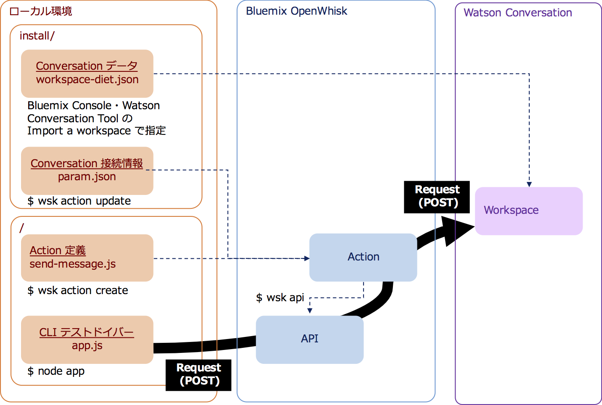
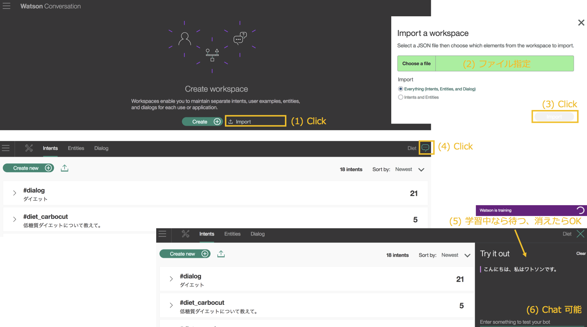
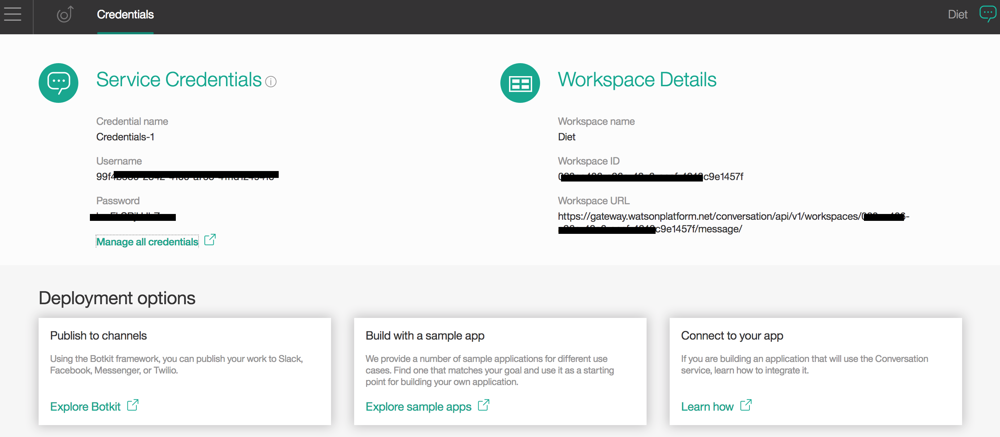

# Serverless Conversation

## はじめに
最近サーバーレスが注目されているようですので、IBM Bluemix の OpenWhisk でサーバーレスアプリを作成してみました。

## アプリの構成
* Watson Conversation の特定ワークスペースに Send Massage する Action を作成します。
* ワークスペースには「さわってみようWatson on Bluemix」(IBM) の Natural Language Classifier と Dialog による会話の仕組みを Conversation に移植したものを使用します。
  - 過去に関連した音声認識付き Chatbot アプリを作成しています。リポジトリは [こちら](https://github.com/ippei0605/watson-diet-trainer) です。
* Action は APIs (experimental) で外部公開します。
* クライアントは Node.js で CLI テストドライバーを作成します。今後 React Native などへの差し換えを検討します。

### コンポーネント関連図
各層のコンポーネントと関連を以下に示します。


## セットアップ
このアプリをセットアップする手順を示します。

### ローカル環境の事前準備
1. 本リポジトリから serverless-conversation アプリをダウンロード (Download ZIP) して解凍してください。ディレクトリ名は serverless-conversation-master から serverless-conversation に変更してください。

1. Node.js をセットアップしてください。アプリは ES6 の記法で記述しています。私が使用したバージョンは v7.2.0 です。
です。

1. OpenWhisk CLI をセットアップしてください。
    1. Bluemix コンソールにログインしてください。Region は US South としてください。(現時点では他の Region に OpenWhisk はございません。)
    1. [こちら](https://console.ng.bluemix.net/openwhisk/learn/cli) から CLI をダウンロードして解凍してください。
    1. Bluemix コンソールで Space が未定義な場合は定義してください。 (私は dev としました。)
    1. ローカル PC のターミナルソフトを起動してください。(私は IntelliJ IDEA や Eclipse のターミナルを使っていますが、Windows の cmd 、Mac の　ターミナルなどで操作できます。
    1. ターミナルソフトで解凍した wsk コマンドをパスが通っているディレクトリに を配置してください。(私は macOS Sierra で作業していますので /usr/local/bin に mv しました。)
    1. ターミナルソフトで Authorization Key を設定してください。(Bluemix コンソールでご自身の環境の Authorization Key が付いたコマンドをコピーできます。例を以下に示します。)
    ```
    $ wsk property set --apihost openwhisk.ng.bluemix.net --auth 45xxxx5d-af96-4xxx-8xxf-97fxxxx00a08:0xxxxV9EyVxF3XXXXXmcaJREjgdLaXXXXXxXX0xXXXXXXJYllyEbbZJo1J6Ab
    ```

### Watson Conversation
1. Bluemix コンソールにログインしてください。ここでは次の条件で説明をします。ご自身のアカウント情報に読替えて手順を進めてください。  
  - Region: US South
  - Organization: jiec_gitou
  - Space: dev

1. Bluemix コンソールで Conversation サービスを作成してください。  
サービス名: 任意  
プラン: 任意 (本アプリでは Free を選択) 

1. Manage タブに移動して「Launch tool」をクリックしてください。Watson Conversation ツールが起動します。

1. 以下の要領でワークスペースを作成してください。


1. Watson Conversation ツールのサイトメニュー Deploy - Credentials でワークスペースの接続情報を確認してください。この値は後で使用します。


### ローカル環境
1. Node.js をセットアップしてください。アプリは ES6 の記法で記述しています。私が使用したバージョンは v7.2.0 です。
です。
1. wsk コマンドをセットアップしてください。 [こちら](https://console.ng.bluemix.net/openwhisk/learn/cli) から最新の CLIをダウンロードできます。

1. serverless-conversation アプリをダウンロード (Download ZIP) して解凍してください。ディレクトリ名は serverless-conversation-master から serverless-conversation に変更してください。


1. Bluemix コンソールにログインしてください。ここでは次の条件で説明をします。ご自身のアカウント情報に読替えて手順を進めてください。  
  - Region: Sydney
  - Organization: jiec_gitou
  - Space: dev
  


* Node-RED から Node.js に移植しました。
* Dialog の廃止に伴い、当該機能を削除しました。
* 質問 (テキスト) 以外にローカルの日時をサーバに送信、general-hello クラスの「おはよう」(5〜11時)、「こんにちは」(11〜17時)、「こんばんは」(17時〜24時)、「お疲れ様です」(0〜5時) の出し分けを追加しました。
* Text to Speech によるテキストの読上げ機能を追加しました。(PC の Chrome、Firefox に対応)  
* Google Speech API による音声認識機能を追加しました。(PC の Chrome に対応)  
* 管理機能を追加しました。
    - コンテンツ参照
    - トレーニングデータ抽出
    - Natural Language Classifier 操作用GUI
    
## 参考資料  
* [Plan Bのおすすめ: OpenWhiskにAPI管理の機能されたので試す](https://www.niandc.co.jp/sol/tech/date20161216_568.php)
