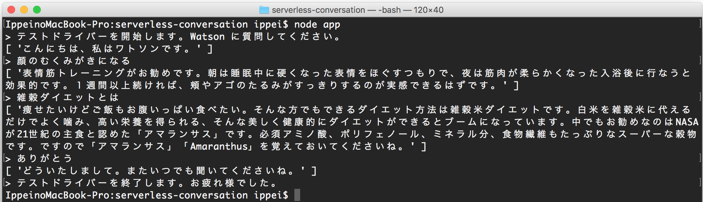

# Serverless Conversation

## はじめに
最近はサーバーレスアーキテクチャーが注目されているようです。どんなものか興味が湧きましたので、IBM Bluemix OpenWhisk を用いて、Watson Conversation を呼び出すサーバーレスアプリを作成してみました。

## アプリの構成
* Watson Conversation の特定ワークスペースに Send Massage する Action を作成します。
* ワークスペースには「さわってみようWatson on Bluemix」(IBM) の Natural Language Classifier と Dialog による会話の仕組みを Conversation に移植したものを使用します。
  - 過去に関連した音声認識付き Chatbot アプリを作成しています。リポジトリは [こちら](https://github.com/ippei0605/watson-diet-trainer) です。
* Action は APIs (experimental) で外部公開します。
* クライアントは Node.js で CLI テストドライバーを作成します。今後 React Native などへの差し換えを検討します。

### コンポーネント関連図
各層のコンポーネントと関連を以下に示します。


## セットアップ

### ローカル環境の事前準備
1. 本リポジトリから serverless-conversation アプリをダウンロード (Download ZIP) して解凍してください。ディレクトリ名は serverless-conversation-master から serverless-conversation に変更してください。

1. Node.js をセットアップしてください。アプリは ES6 の記法で記述しています。私が使用したバージョンは v7.2.0 です。

1. OpenWhisk CLI をセットアップします。
    1. Bluemix コンソールにログインしてください。Region は US South としてください。(現時点では他の Region に OpenWhisk はございません。)
    1. [こちら](https://console.ng.bluemix.net/openwhisk/learn/cli) から CLI をダウンロードして解凍してください。
    1. Bluemix コンソールで Space が未定義な場合は定義してください。 (私は dev としました。)
    1. ローカル PC のターミナルソフトを起動してください。(私は IntelliJ IDEA や Eclipse のターミナルを使っていますが、Windows の cmd 、Mac のターミナルなどで操作できます。
    1. ターミナルソフトで解凍した wsk コマンドをパスが通っているディレクトリに を配置してください。(私は macOS Sierra で作業していますので /usr/local/bin に cp しました。)
        ```
        sudo cp wsk /usr/local/bin
        ```
        
    1. ターミナルソフトで Authorization Key を設定してください。(Bluemix コンソールでご自身の環境の Authorization Key が付いたコマンドをコピーできます。例を以下に示します。)
        ```
        $ wsk property set --apihost openwhisk.ng.bluemix.net --auth 45xxxx5d-af96-4xxx-8xxf-97fxxxx00a08:0xxxxV9EyVxF3XXXXXmcaJREjgdLaXXXXXxXX0xXXXXXXJYllyEbbZJo1J6Ab
        ```

### Watson Conversation
以下は Bluemix コンソールでの作業になります。

1. Bluemix コンソールにログインしてください。ここでは次の条件で説明をします。ご自身のアカウント情報に読替えて手順を進めてください。  
      - Region: US South
      - Organization: jiec_gitou
      - Space: dev

1. Bluemix コンソールで Conversation サービスを作成してください。  
サービス名: 任意  
プラン: 任意 (本アプリでは Free を選択) 

1. Manage タブに移動して「Launch tool」をクリックしてください。Watson Conversation ツールが起動します。

1. 以下の要領でワークスペースを作成してください。


1. <a name="credentials">Watson Conversation ツールのサイトメニュー Deploy - Credentials でワークスペースの接続情報を確認してください。[この値は後で使用](#param)します。


### OpenWhisk
以下はローカル環境のターミナルソフトでの作業になります。

1. OpenWhisk 設定のため、解凍したディレクトリに移動します。
    ```
    $ cd serverless-conversation
    ```

1. パッケージを作成します。パッケージ名は任意、ここでは私を表す接頭語を付加して B20-O970605-Conversation としています。
    > 同じ Region、Organization、Space を他の方とシェアしている場合は上書きの可能性がありますので注意してください。 (サブスクリプション契約など)          
    ```
    $ wsk package create B20-O970605-Conversation
    ```

1. アクションを作成します。コードは send-message.js を使用します。
    ```
    $ wsk action create B20-O970605-Conversation/send-message send-message.js
    ```

1. アクションリストを確認します。作成したアクション以外にデフォルトで　Hello World などが表示されると思います。
    ```
    $ wsk action list
    actions
    /jiec_gitou_dev/B20-O970605-Conversation/send-message    private nodejs:6
    ....(省略)....
    ```

1. アクションのパラメータに Conversation ワークスペースの接続情報を設定します。今回はファイルから設定することにします。

    1. テキストエディタで install/param.json を開いてください。
        ```
        {
          "username": "{username}",
          "password": "{password}",
          "url": "https://gateway.watsonplatform.net/conversation/api/v1/workspaces/{workspace_id}/message?version=2017-02-03"
        }
        ```
    1. <a name="param">[先程確認したワークスペースの接続情報](#credentials)により、以下の要領で install/param.json を編集、保存、閉じてください。
        - *{username}* を Username の値に変更
        - *{password}* を Password の値に変更
        - *{workspace_id}* を Workspace ID の値に変更
    
    1. 次のコマンドを実行します。
        ```
        $ wsk action update B20-O970605-Conversation/send-message -P install/param.json
        ```

1. アクションを実行してエラーがないことを確認してください。
    ```
    $ wsk action invoke B20-O970605-Conversation/send-message --blocking --result
    ```

1. 外部公開のため API [^1](#footnote1) を作成します。ここでは次の条件でコマンドを実行します。
    - API 名: Diet Conversation (-n オプションで指定)
    - BASE_PATH: /api
    - API_PATH: /chat
    
    > 同じ Region、Organization、Space を他の方とシェアしている場合は、BASE_PATH と API_PATH が同じだと上書きされます。適宜変更してください。 (サブスクリプション契約など) 
    
     ```
     $ wsk api-experimental create -n "Diet Conversation" /api /chat post B20-O970605-Conversation/send-message
     ```
    
## ローカル環境
以下はローカル環境のターミナルソフトでの作業になります。

1. CLI テストドライバーのセットアップのために、解凍したディレクトリに移動します。
    ```
    $ cd serverless-conversation
    ```

1. CLI テストドライバーで使用するモジュールをセットアップします。
    ```
    npm install
    ```

1. CLI テストドライバーの定数定義を変更します。

    1. テキストエディタで app.js を開いてください。
    
    1. TODO コメントの通り、*{url}* を変更してください。
        ```javascript
        //TODO: {url} をご自身の API の URL に変更してください。wsk api-experimental list コマンドで URL を参照できます。
        const url = '{url}';
        ```
    1. app.js を保存、閉じてください。
    
1. CLI テストドライバーの実行します。
    ```
    $ node app
    ```

## CLI テストドライバーの操作方法
テキストを入力してリターンキーを押すことでダイエットに関するチャットができます。Ctrl + c または Ctrl +d で終了します。
次のような質問をしてご確認ください。
* 雑穀ダイエットとは
* ダイエットしたい
* ありがとう

実行結果を以下に示す。



## まとめ
* 当初は CLI ではなく Web アプリでテストドライバーを作成しようとしましたが、CORS の設定ができず、jquery、fetch ともアクセスエラーとなるため断念しました。experimental がとれるのを待とうと思ってます。
* Node.js の request からは API アクセスできました。
* 今後は React Native でクライアントを作り、Serverless との連携を検証しようと思います。
* Bluemix OpenWhisk Package Catalog には Watson STT、TTS、Translator などのアクションが整備されていますので、今回作成した Conversation も近い内にリリースされるかもしれません。
* 処理結果を同期して返す場合は、処理時間が長くなり想定以上にコストがかかるかもしれません。今回は Conversation Send Message の結果を同期して返値しています。(同期しない場合は {} が返ります。) 複数の処理をアクションに記述する場合や、アクションをシーケンスで繋げる場合など、パフォーマンス、エラーハンドリング、コスト最適化などの留意が必要と感じました。

## 脚注
1.<a name="footnote1"> ^ API Experimental は実験的との意味でしょうが、今回の方法なら動作します。現時点ではBluemix コンソール Open Whisk の APIs は参照できますが不安定、wsk api は COMING SOON となっています。

## 参考資料  
* [Plan Bのおすすめ: OpenWhiskにAPI管理の機能されたので試す](https://www.niandc.co.jp/sol/tech/date20161216_568.php)