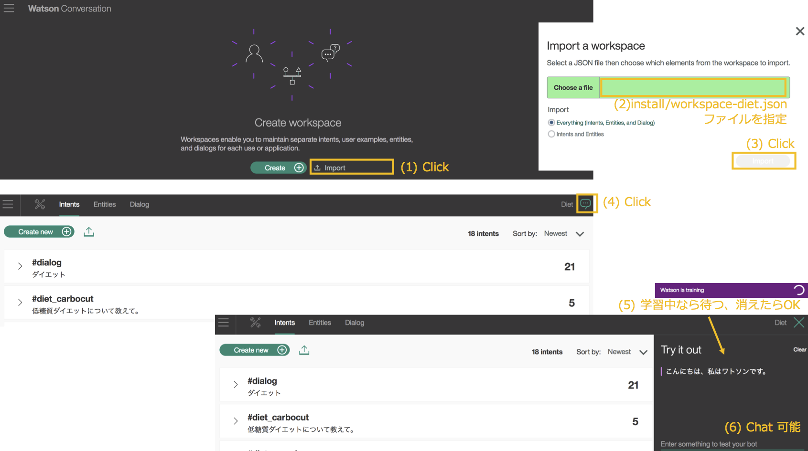

# Serverless Conversation

## はじめに
最近サーバーレスが注目されているようですので、IBM Bluemix の OpenWhisk でサーバーレスアプリを作成してみました。

## アプリの構成
* Watson Conversation の特定ワークスペースに Send Massage する Action を作成します。
* ワークスペースには「さわってみようWatson on Bluemix」(IBM) の Natural Language Classifier と Dialog による会話の仕組みを Conversation に移植したものを使用します。
* Action は APIs (experimental) で外部公開します。
* クライアントは Node.js で CLI テストドライバーを作成します。今後 React Native などへの差し換えを検討します。

### コンポーネント関連図
各層のコンポーネントと関連を以下に示します。

### 関連図

* Node-RED から Node.js に移植しました。
* Dialog の廃止に伴い、当該機能を削除しました。
* 質問 (テキスト) 以外にローカルの日時をサーバに送信、general-hello クラスの「おはよう」(5〜11時)、「こんにちは」(11〜17時)、「こんばんは」(17時〜24時)、「お疲れ様です」(0〜5時) の出し分けを追加しました。
* Text to Speech によるテキストの読上げ機能を追加しました。(PC の Chrome、Firefox に対応)  
* Google Speech API による音声認識機能を追加しました。(PC の Chrome に対応)  
* 管理機能を追加しました。
    - コンテンツ参照
    - トレーニングデータ抽出
    - Natural Language Classifier 操作用GUI